# 操作系统

## 引言

### 操作系统的基本特征：并发，共享，虚拟，异步

#### 并发与并行的辨析：

并发是两个或多个事件在==同一时间间隔内==发生，实质是“宏观上都在运行，微观上交替执行”，而并行是两个或多个事件在==同一时刻==发生，实质是“多核CPU运行多道程序，同时执行，互不干扰”

并发 ——> 单核CPU，并行 ——> 多核CPU

#### 共享（针对系统资源来说的）

目的：使得系统中的资源，供内存中多个==并发执行==的进程共同使用

分为：互斥共享 和 同时访问

系统中某些资源，需要互斥共享（规定在一段时间内，只允许一个进程访问该资源），比如打印机，摄像头；而有些资源，允许一段时间内多个进程同时对他们进行访问（宏观上同时执行）（微观上不确定是交替还是同时），比如磁盘读取文件，扬声器。

#### 互斥共享 和 同时访问 的区别：

互斥共享：独占使用。（当资源被进程A占用时，进程B想用？没门！只能阻塞，直到A用完释放）

同时访问：允许并发，多方共用。（进程A在用，进程B也可以用。大家不用严格排队等对方彻底结束）

#### 虚拟

分为两种技术：时分复用，空分复用

时分复用：你只有一个单核CPU，但系统里开了100个进程，利用时间轮转法，让多个程序并发执行，每个进程都以为自己独占一个CPU。

空分复用：你物理内存只有8G，但你可以玩50G的游戏。实质是：操作系统在背后将数据在内存和外存之间来回倒腾（“缺页中断”和“置换算法”），让你以为内存无限大。

#### 异步 

在并发环境中，进程的执行不是一气呵成的，而是走走停停。

如果不加以管理，这会导致：同样的程序每一次的结果不同（结果不可再现性）。因此，我们需要进程同步机制（信号量，锁）。

## 处理机调度

### 调度算法的评价指标

1. CPU利用率

​	

​	

2. 系统吞吐量

   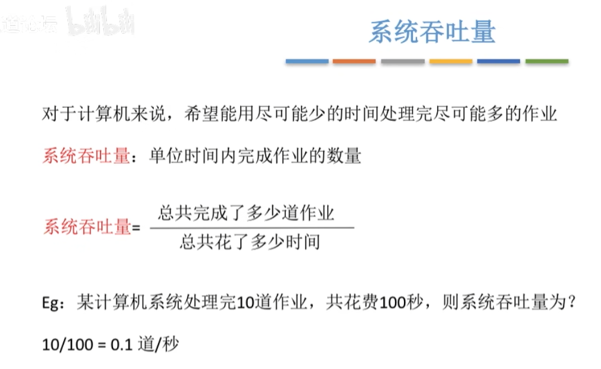

3. 周转时间

​	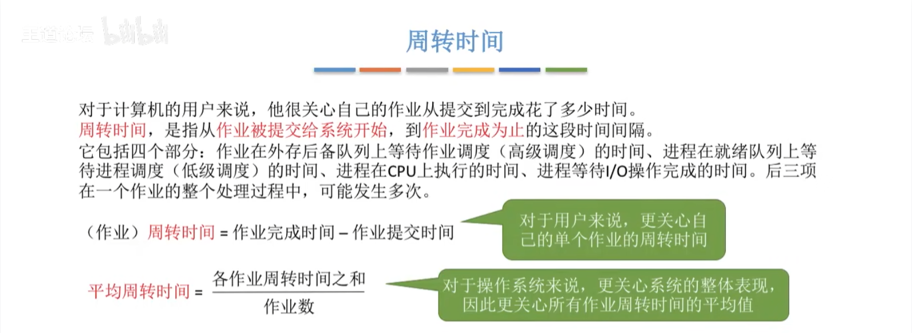

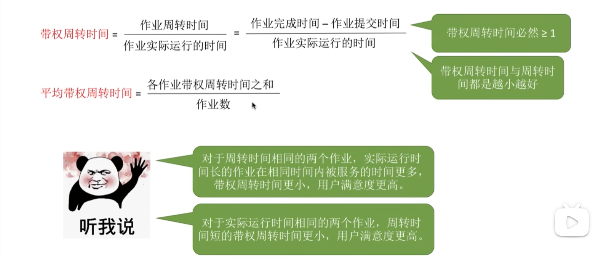

4. 等待时间

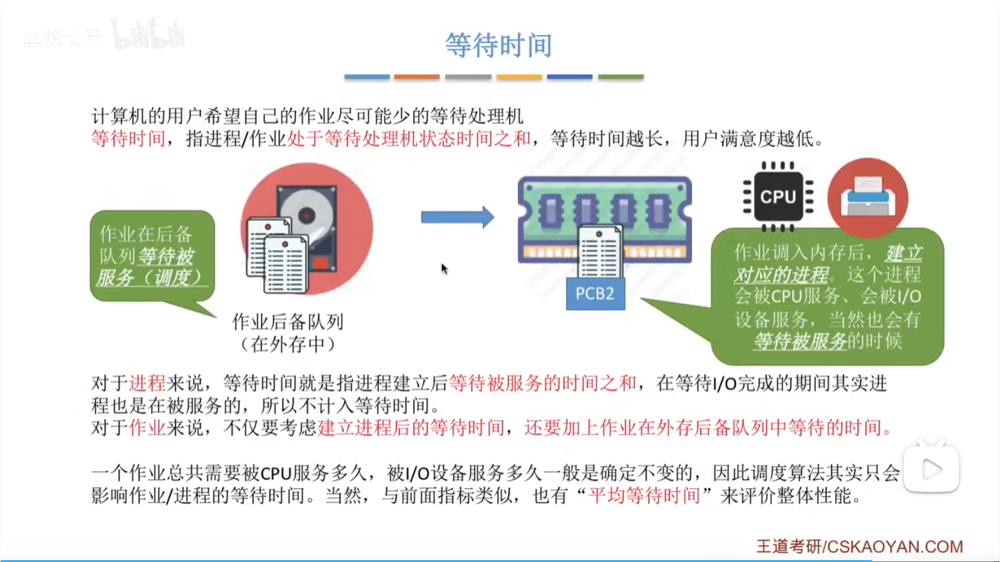

### 调度算法（先来先服务，短作业优先，高响应比优先）

Tips：各种调度算法的学习思路

1. 算法思想 
2. 算法规则 
3. 这种调度算法是用于 作业调度 还是 进程调度？ 
4. 抢占式？非抢占式？ 
5. 优点和缺点 
6. 是否会导致饥饿 （某进程/作业长期 得不到服务）

#### 先来先服务（FCFS）

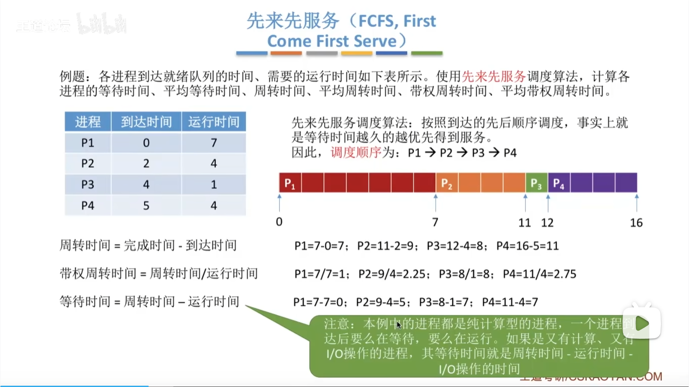

## 进程同步问题

### 进程同步

假设你和你的伴侣共用一张银行卡，里面有1000块。

1. 你走到ATM机，读出余额：1000。准备取100。（此时CPU切换了！）
2. 伴侣在手机APP上，读出余额：1000。准备存100。
3. 伴侣的操作先完成：1000+100=11001000+100=1100。写入数据库。
4. 你的操作接着完成（你手里拿的数据还是旧的1000）：1000−100=9001000−100=900。写入数据库。

结果：数据库变成了900。伴侣存的那100块凭空消失了！

因此：如果不加控制，并发进程对共享数据（临界资源）的乱序访问，会导致数据不一致。所以我们需要“同步”。

**同步机制必须遵循的四条准则：**

- 空闲让进（没人用你就进）；
- 忙则等待（有人用你就等）；
- 有限等待（不能一直等）；
- 让权等待（等待的过程中，先把CPU让出，不能占着茅坑不拉屎）；

先来了解一下几个概念：

临界资源：一次只允许一个进程使用的资源

临界区：程序中访问临界资源的那段代码

信号量（分为：整型信号量，记录型信号量）：可用资源数量（负值表示：无可用资源，且存在资源请求）

原语：特殊的程序段，如果选择执行，则必须完全执行，不可中断

P操作（wait原语）：申请资源（进入区）

V操作（signal原语）：释放资源（退出区）

### 信号量机制

下边的三个模型（生产者-消费者问题，读者写者问题，哲学家进餐问题），都是解决：在并发进程中，资源共享的问题。（也就是说：在都是并发执行的情况下，不能产生 “死锁”（永远运行不了）现象）

### 经典模型1：生产者-消费者问题

有两个进程A和B，它们共享一个固定大小的缓冲区，A进程产生数据放入缓冲区，B进程从缓冲区中取出数据进行计算，那么这里其实就是一个生产者和消费者的模式，A相当于生产者，B相当于消费者。

要求：

- 只有缓冲区没满时，生产者才能把产品放入缓冲区，否则必须等待。
- 只有缓冲区不空时，消费者才能从中取出产品，否则必须等待。
- 缓冲区是临界资源，各进程必须互斥地访问。

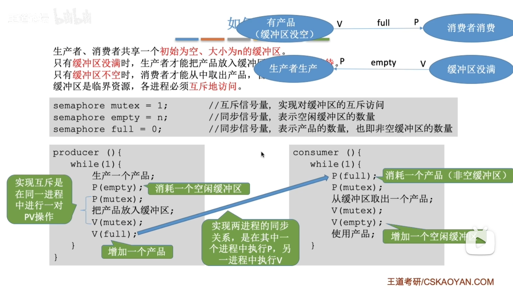

在 “生产者-消费者” 模型中，存在两对重要关系：互斥关系，同步关系；

互斥关系描述的是：对临界资源的 “独占” ；

同步关系描述的是：进程执行，一前一后的关系；

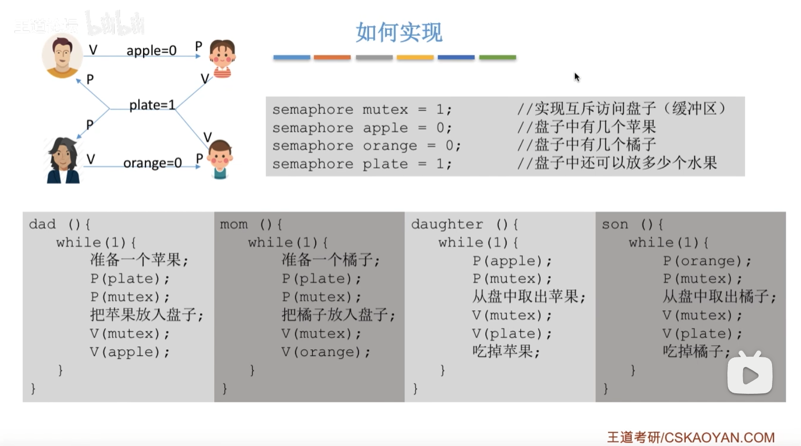

### 经典模型2：读者-写者问题

与“生产者-消费者”模型最大的不同在于：**读者之间不存在互斥关系**。

1. 读-读允许

2. 写-写互斥 

3. 读-写互斥 

   

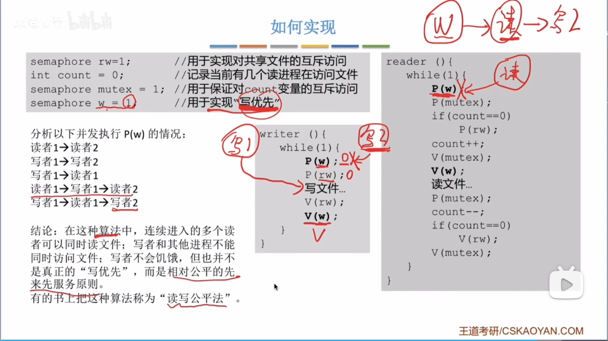

### 经典模型3：哲学家进餐问题

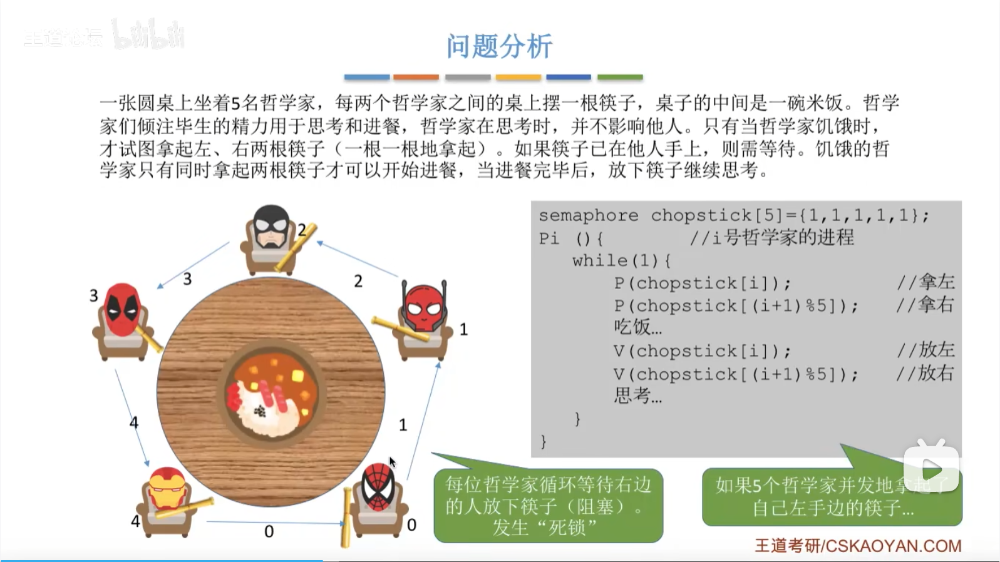

若五位哲学家同时饥饿而各自拿起了左边的筷子，这使五个信号量 chopstick 均为 0，当他们试图去拿起右边的筷子时，都将因无筷子而无限期地等待下去，即可能会引起死锁。

哲学家进餐问题的改进解法

- 方法一：至多只允许四位哲学家同时去拿左筷子，最终能保证至少有一位哲学家能进餐，并在用完后释放两只筷子供他人使用。
- 方法二：仅当哲学家的左右手筷子都拿起时才允许进餐。
- 方法三：规定奇数号哲学家先拿左筷子再拿右筷子，而偶数号哲学家相反。

方法一的实现：

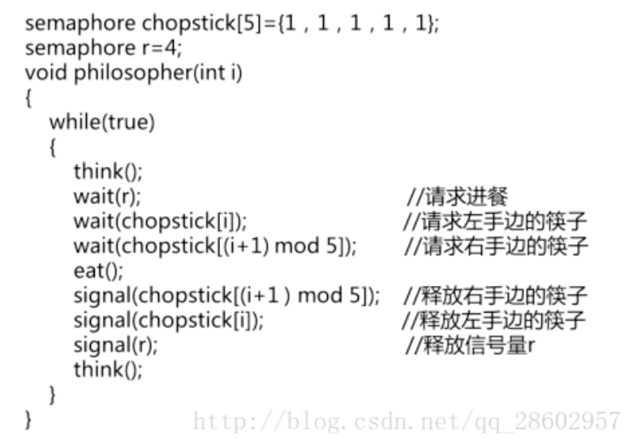

原理：至多只允许四个哲学家同时进餐，以保证至少有一个哲学家能够进餐，最终总会释放出他所使用过的两支筷子，从而可使更多的哲学家进餐。

方法二的实现：

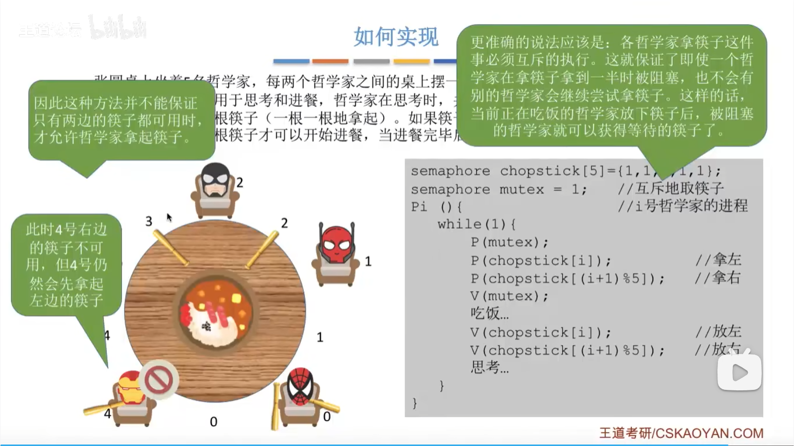

原理：通过互斥信号量 mutex 对 “取筷子” 的操作进行保护，可以防止死锁的出现。

方法三的实现：

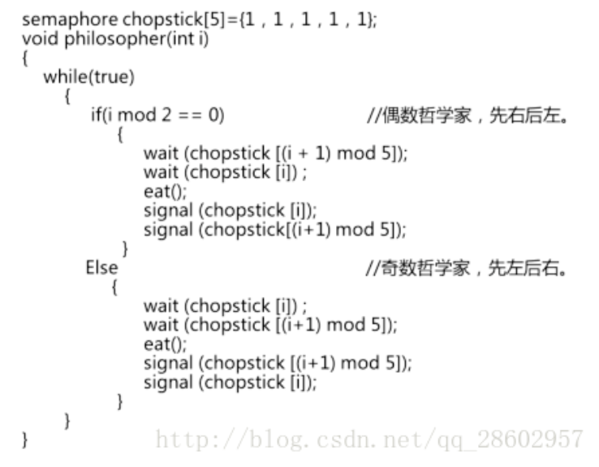

### 死锁

#### 死锁产生的必要条件（4个）：

1. 互斥条件：指进程对所分配到的资源进行排它性使用，即在一段时间内某资源只由一个进程占用。如果此时还有其它进程请求资源，则请求者只能等待，直至占有资源的进程用毕释放。
2. 不可剥夺条件：指进程已获得的资源，在未使用完之前，不能被剥夺，只能在使用完时由自己释放。
3. 请求和保持条件：指进程已经保持至少一个资源，但又提出了新的资源请求，而该资源已被其它进程占有，此时请求进程阻塞，但又对自己已获得的其它资源保持不放。（比如：哲学家进餐问题）
4. 环路等待条件：指在发生死锁时，必然存在一个进程——资源的环形链，即进程集合{P0，P1，P2，···，Pn}中的P0正在等待一个P1占用的资源；P1正在等待P2占用的资源，……，Pn正在等待已被P0占用的资源。

#### 解决方法（3个）：

1. 预防死锁：可以通过设置某些限制条件，去破坏产生死锁的四个必要条件中的一个或者几个，来预防发生死锁。

   预防死锁是一种较易实现的方法，已被广泛使用。但是由于所施加的限制条件往往太严格，可能会导致系统资源利用率和系统吞吐量降低

2. 死锁避免：系统对进程发出的每一个系统能够满足的资源申请进行**动态检查**，并根据检查结果决定是否分配资源；如果分配后系统可能发生死锁，则不予分配，否则予以分配。这是一种保证系统不进入死锁状态的**动态策略**。

3. 死锁检测和解除：这种方法并不事先采取任何限制性措施，此方法**允许系统在运行过程中发生死锁**。但可通过系统所设置的检测机制，及时地检测出死锁的发生，并精确地确定与死锁有关的进程和资源。然后采取适当措施，从系统中将已发生的死锁清除掉。

   常用的实施方法是撤销或挂起一些进程，以便回收一些资源，再将这些资源分配给已处于阻塞状态的进程，使之转为就绪状态，以继续运行。死锁的检测和解除措施，有可能使系统获得较好的资源利用率和吞吐量，但在实现上难度也最大。

## 

